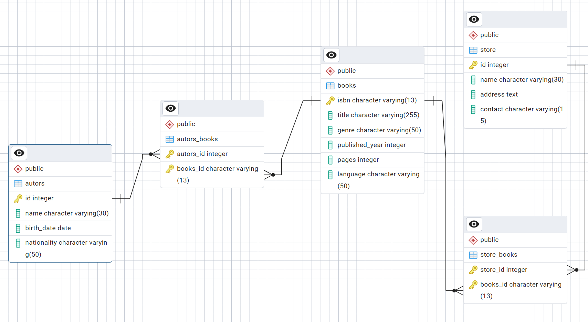

# Books
1. Készítsd el a képen látható adatbázist



1. Ha jól dolgoztál letudod futatni a insert_books.sql fájl utasításait (futasd is le :D)1
1.  Módosítsd a Readers' Paradise bolt nevét Readers' Haven-re.
1. Frissítsd a The Shining könyv oldalainak számát 643-ra.
1. Agatha Christie esetében frissítsd a nemzetiséget English-ről British-re.
1. Adj hozzá egy új mezőt a autors táblához, amely jelzi, hogy az író még él-e (boolean típus).
1. Frissítsd a szerzők státuszát az újonnan hozzáadott is_alive mezőben:
    - Az élő szerzők: J.K. Rowling, George R.R. Martin, Neil Gaiman, Andy Weir.
    - Az elhunyt szerzők: Stephen King, Agatha Christie, Terry Pratchett, Isaac Asimov, Arthur C. Clarke.
1. Módosítsd a Novel Nook bolt címét a következőre: 789 Fiction St, Novel Town.
1. Frissítsd a Foundation könyv műfaját Science Fiction helyett Epic Science Fiction-re.
1. Módosítsd J.K. Rowling nevét Joanne Rowling-ra.
1. Frissítsd a 1984 könyv ISBN kódját, hogy az új kiadás ISBN-je legyen 9780141036144.
1. Adj hozzá egy email mezőt a store táblához, amely tárolja a boltok email-címét.
1. Adj meg egy email-címet a Book Heaven boltnak: info@bookheaven.com.
1. Frissítsd a Harry Potter and the Philosopher's Stone megjelenési évét 1997-ről 2001-re.
1. Frissítsd The Martian könyv nyelvét angolról franciára (French).
1. Frissítsd Stephen King születési dátumát, hogy helyesen 1947-09-21-re legyen beállítva.

1. Az adatbázis nem tartalmaza a könyvek árait. Vedd fel megfelelőhelyre a price mezőt. Úgy hogy ne veszíts adatot. Elvárás hogy minden boltban más ára lehesen minden könyvenk.
1. Töltsd fel a price mezőt minden rekord esetében random 5000 és 10000 forint közötti kerek ezres értékkel.

<DETAILS>
Random egész szám generálása egy adott tartományban

(pl. 5000 és 10000 között):

 ```sql
FLOOR(random()*6)1000+5000
  ``` 
 </DETAILS>

18. Az Novel Nook bolt árat emel 10% al minden olyan könyvön ami 1990 után került kiadásra
1. Vegyél fel egy új boltot 'Who read' néven , '1 Main St, Budapest' címmel elérhetőségek nélkül


