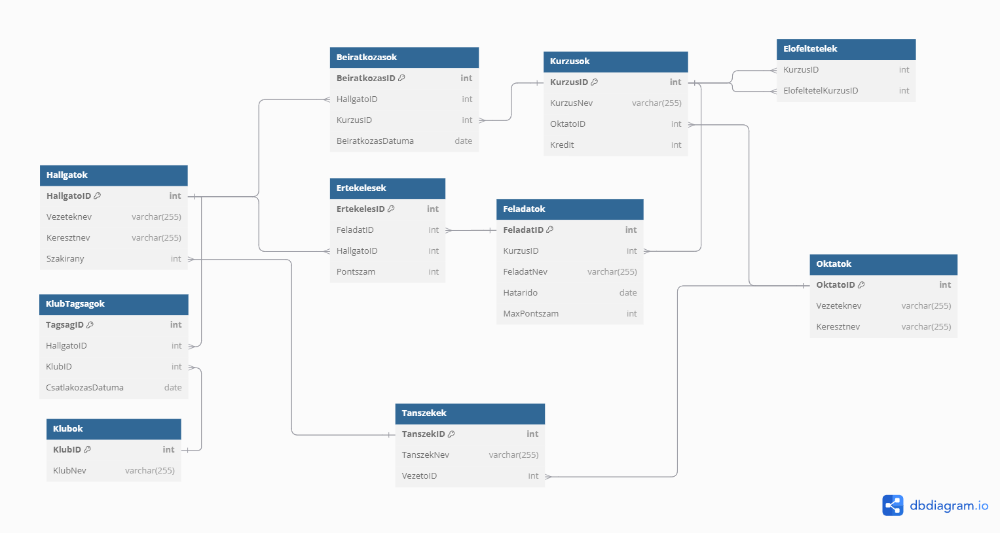

# Online oktatási platform - adatbázis tervezése és lekérdezéses feladatok

## Adatbázis tervezési feladat

Egy online oktatási platform adatbázisát kell megtervezni, amelyben különböző entitásokat, például kurzusokat, oktatókat, hallgatókat, tanszékeket és klubokat kezelünk. A feladat lényege, hogy logikus kapcsolatokat alakítsunk ki ezek között az entitások között. A feladat része az is, hogy az adatok integritását biztosító szabályokat vezessünk be, valamint figyelembe vegyük az adatbázis hatékonyságát és skálázhatóságát.

### 1. Hallgatók kezelése

A platformon számos hallgató vesz részt, mindegyikük egy adott szakon tanul, és az adott szakhoz tartozó kurzusokra iratkozik be. A hallgatók adatai között szerepelnie kell a nevüknek, beiratkozási dátumuknak, valamint a szakuknak (a tanszékük ID-jának). A hallgatók különböző feladatokat végeznek el a kurzusaikon, és ezekre pontokat kapnak, amelyeket szintén nyilván kell tartani.

### 2. Kurzusok és azok előfeltételei

A kurzusok olyan tananyagokat reprezentálnak, amelyeket oktatók tanítanak. Minden kurzusnak van egy meghatározott kreditértéke, amely jelzi annak súlyát a hallgatók tanulmányai során. Egyes kurzusokhoz előfeltételek tartozhatnak, vagyis egy hallgató csak akkor vehet fel egy adott kurzust, ha már teljesített egy vagy több másik kurzust. Ez egy önreferenciás kapcsolatot eredményez a kurzusok között.

### 3. Oktatók és tanszékek

Az oktatók különböző tanszékeken dolgoznak, és minden oktató több kurzust is tarthat. A tanszékek az egyetem különböző tudományos egységeit képviselik, és minden tanszéknek van egy vezetője, aki egy adott oktató. Fontos biztosítani, hogy egy oktató csak egy tanszék vezetője lehessen, és egy tanszékhez csak egy vezető tartozhat.

### 4. Feladatok és értékelések

Minden kurzushoz különböző feladat tartozik, amelyeket a hallgatóknak a megadott határidőre kell beadniuk. A feladatokhoz maximális pontszám van hozzárendelve, és a hallgatók által elért pontokat folyamatosan rögzíteni kell. Az értékelések összekapcsolják a hallgatók teljesítményét a kurzusok feladataival.

### 5. Beiratkozások

A hallgatók beiratkoznak kurzusokra, és a beiratkozások időpontjai is rögzítésre kerülnek. Egy hallgató több kurzusra is beiratkozhat, és egy kurzusra több hallgató is beiratkozhat. A beiratkozások révén követhetjük nyomon, hogy egy hallgató mely kurzusokon vesz részt.

### 6. Klubok és tagság

A hallgatók részt vehetnek különböző hallgatói klubokban, ahol közösségi tevékenységeket végezhetnek. Egy hallgató több klub tagja is lehet, és egy klubnak több hallgatója is lehet. A klubtagságokat külön tábla kezeli, amely rögzíti a hallgatók klubokhoz való csatlakozásának időpontját.

### Tervezési szempontok

- **Kapcsolatok:** Fontos biztosítani, hogy a hallgatók és kurzusok közötti kapcsolatokat beiratkozási adatokon keresztül kezeljük. Egy hallgató sok kurzusra iratkozhat be, és egy kurzusnak sok hallgatója lehet, tehát ez egy many-to-many kapcsolat.
- **Önreferenciás kapcsolatok:** A kurzusok előfeltételeinek kezelése önreferenciás kapcsolatokként jelennek meg, mivel egy kurzusnak más kurzus(ok) lehetnek előfeltételei.
- **Integritás:** Az oktatók és tanszékek közötti kapcsolatokat úgy kell kialakítani, hogy minden tanszéknek csak egy vezetője lehessen, és egy oktató ne vezethessen több tanszéket.
- **Adatkonzisztencia:** Az értékelések, feladatok és kurzusok közötti kapcsolatok biztosítják, hogy egy hallgató teljesítménye minden egyes kurzusra visszavezethető legyen. Fontos, hogy minden értékelés a megfelelő hallgatóhoz és feladathoz legyen kapcsolva.

### Kihívások és összetettség

- **Self-referencing kapcsolat kezelése:** A kurzusok előfeltételeinek kezelése különösen fontos, mert egyes kurzusok több előfeltétellel is rendelkezhetnek, és ezeket dinamikusan kell kezelni.
- **Many-to-many kapcsolat:** A hallgatók és klubok közötti kapcsolat sok-sok kapcsolat, amely külön kapcsolótáblában kezelhető.
- **Feladatok és pontszámok súlyozása:** A feladatok maximális pontszáma és a hallgatók teljesítményének súlyozása szintén komplexitást ad az adatbázis kezeléséhez.

---

### Javasolt megoldás (el lehet térni tőle)



---

## Lekérdezéses feladatok

### 1. feladat:

Listázd ki az összes hallgatót, aki egy megadott kurzusra beiratkozott (pl. 1-es ID)!

---

### 2. feladat:

Listázd ki az oktatókat, akik tanszékvezetők is!

---

### 3. feladat:

Listázd ki a kurzusokat és azok előfeltételeit!

---

### 4. feladat:

Számold ki az egyes hallgatók átlagos pontszámát egy adott kurzusban!

---

### 5. feladat:

Listázd ki azokat a hallgatókat, akik több mint egy kör tagjai!

---

### 6. feladat:

Listázd ki azokat a tanszékeket, amelyeknek nincs vezetője!

---

### 7. feladat:

Listázd ki azon oktatókat, akik több kurzust is tanítanak!

---

### 8. feladat:

Listázd ki azon hallgatókat, akik beiratkoztak egy kurzusra, de nem adtak be feladatot!

---

### 9. feladat:

Listázd ki azon kurzusokat, amelyeknek több előfeltétele is van!

---

### 10. feladat:

Számold ki az egyes hallgatók által felvett összes kreditet!

---

### 11. feladat:

Listázd ki azon hallgatókat, akik még nem iratkoztak be egyetlen kurzusra sem!

---

### 12. feladat:

Listázd ki azon hallgatókat csoportosítva, akik ugyanazon klubhoz tartoznak!

---

### 13. feladat:

Listázd ki azokat az oktatókat, akik kurzusaira egyetlen hallgató sem iratkozott be!

---

### 14. feladat:

Írj egy SQL lekérdezést, amely egy hallgató kurzusra történő beiratkozása esetén automatikusan beiratja a hallgatót az adott kurzus előfeltételi kurzusára is, ha van ilyen, és ha még nem iratkozott be az előfeltétel kurzusra.

---

### 15. feladat:

Listázd ki azon hallgatókat, akik több különböző klubban is tagok!

---

### 16. feladat:

Listázd ki azon kurzusokat, amelyekhez még nem hoztak létre feladatot!

---

### 17. feladat:

Számold ki a hallgatói klubok taglétszámát és rendezd csökkenő sorrendben!

---

### 18. feladat:

Listázd ki azon hallgatókat, akik az utóbbi 2 évben iratkoztak be, és legalább egy körnek a tagjai!

---

### 19. feladat:

Írj egy lekérdezést, amely visszaadja azon kurzusok listáját, amelyeket olyan oktatók tanítanak, akik tanszékvezetők is!

---

### 20. feladat:

Készíts egy tárolt eljárást, amely kiszámítja a hallgató súlyozott átlagos pontszámát egy adott kurzusban!

<details>
<summary>Súgó</summary>

```sql
CREATE OR REPLACE FUNCTION AtlagosPontszamitas(p_HallgatoID INT, p_KurzusID INT)
RETURNS TABLE (
    HallgatoID INT,
    Vezeteknev VARCHAR,
    Keresztnev VARCHAR,
    AtlagosPontszam NUMERIC
) AS $$
BEGIN
    RETURN QUERY
    SELECT H.HallgatoID, H.Vezeteknev, H.Keresztnev,
           CAST(SUM(E.Pontszam * F.MaxPontszam) AS NUMERIC) / CAST(SUM(F.MaxPontszam) AS NUMERIC) AS AtlagosPontszam
    FROM Hallgatok H
    JOIN Ertekelesek E ON H.HallgatoID = E.HallgatoID
    JOIN Feladatok F ON E.FeladatID = F.FeladatID
    WHERE F.KurzusID = p_KurzusID AND H.HallgatoID = p_HallgatoID
    GROUP BY H.HallgatoID, H.Vezeteknev, H.Keresztnev;
END;
$$ LANGUAGE plpgsql;

-- Függvény meghívása
SELECT * FROM AtlagosPontszamitas(1, 7);
```

</details>
